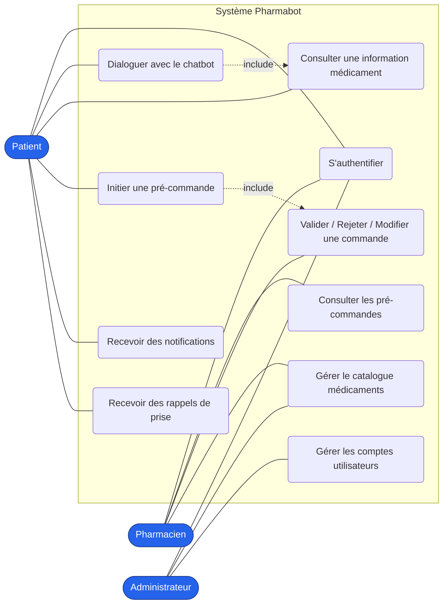
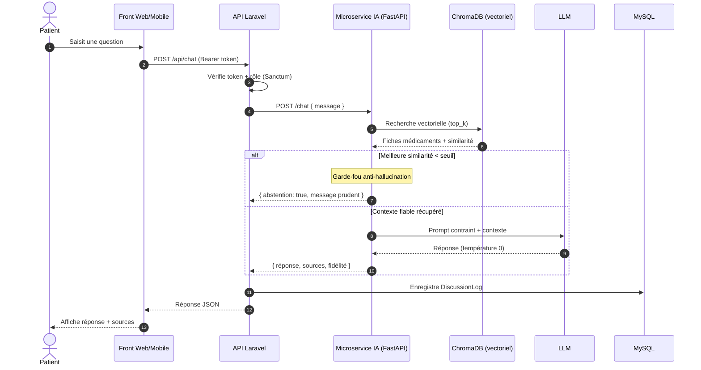
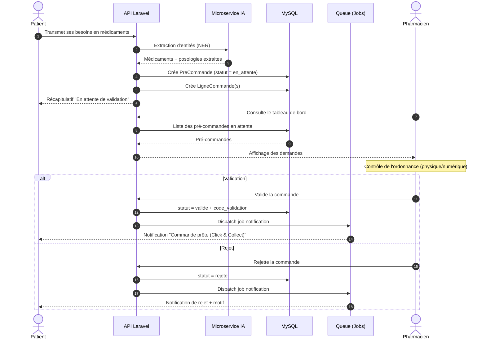
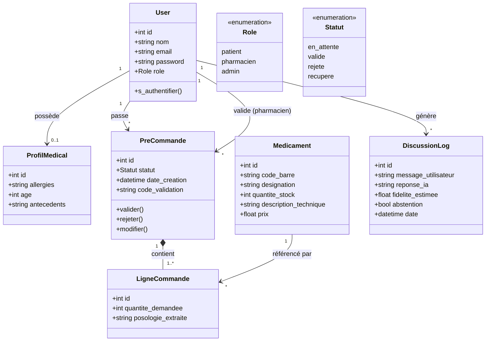
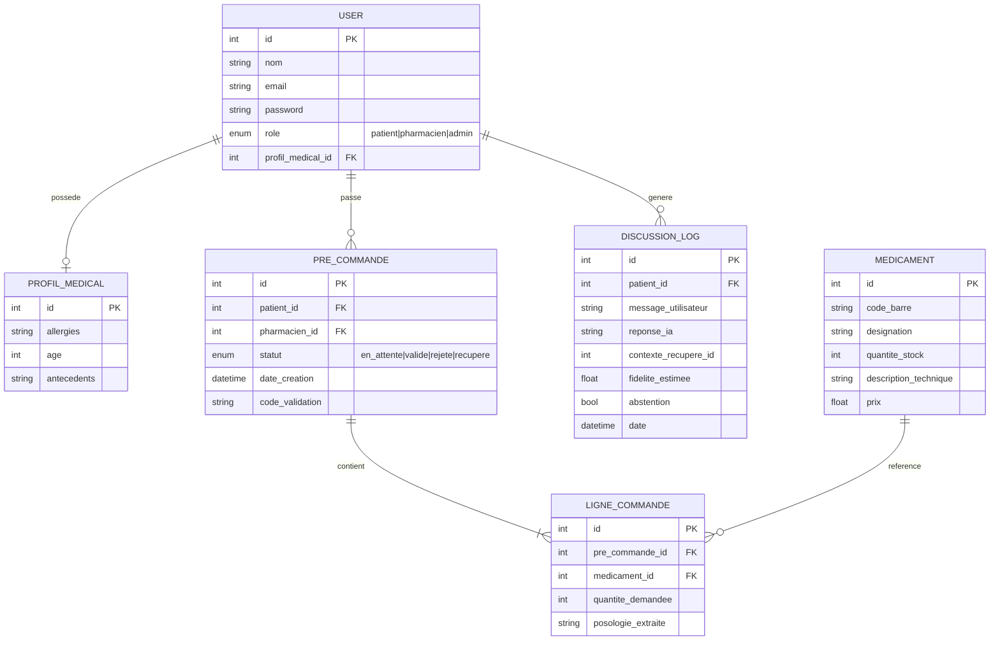
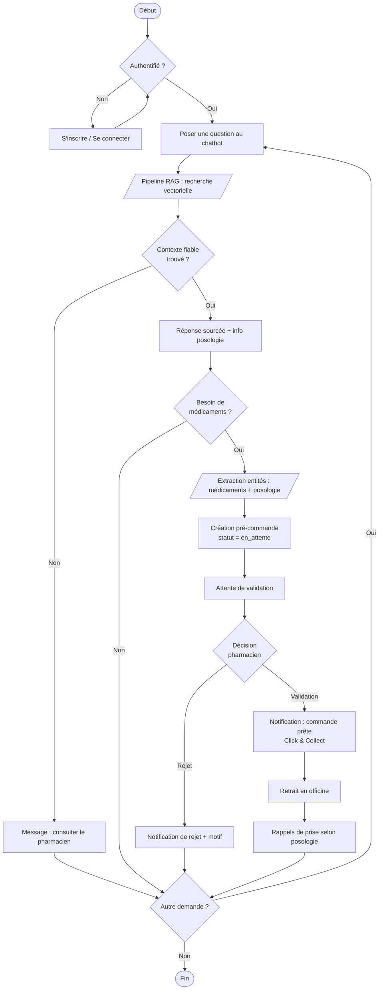

# Diagrammes UML — Pharmabot (livrable Mois 1)

Modélisation UML du système, conforme au cahier des charges. Les sources
Mermaid sont dans `docs/uml/` (rendu direct sur GitHub/VS Code, ou via
[mermaid.live](https://mermaid.live) pour exporter en PNG/SVG vers le mémoire).

---

## 1. Diagramme de cas d'utilisation

Trois acteurs : **Patient**, **Pharmacien**, **Administrateur**. Le patient
dialogue et initie des pré-commandes ; le pharmacien garde le contrôle final
(validation) ; l'admin gère comptes et catalogue.

---

## 2. Diagramme de séquence — Conversation RAG

Chemin synchrone du chat. Met en évidence le **garde-fou anti-hallucination** :
si la similarité du meilleur document récupéré est sous le seuil, le système
s'abstient au lieu de laisser le LLM inventer.

---

## 3. Diagramme de séquence — Pré-commande & validation pharmacien

Illustre la **validation humaine obligatoire** (RF-04, RF-05, RF-06) et
l'asynchronisme des notifications via les queues Laravel.

---

## 4. Diagramme de classes

Vue objet des 6 entités pivots et de leurs relations. Deux énumérations
(`Role`, `Statut`) bornent les valeurs autorisées.

---

## 5. Modèle physique de données (entité-association)

Traduction relationnelle pour MySQL : clés primaires (PK) et étrangères (FK).

---

## 6. Diagramme d'activité — Parcours patient global

Vue d'ensemble du flux, de la connexion au retrait en officine. Intègre les
deux points de contrôle clés : le **garde-fou** (contexte fiable ?) et la
**décision du pharmacien** (validation/rejet).

---

## Export pour le mémoire

Pour intégrer ces diagrammes dans le document Word/LaTeX du mémoire :

1. Ouvrir [mermaid.live](https://mermaid.live)
2. Coller le contenu d'un fichier `.mermaid`
3. Exporter en **SVG** (qualité vectorielle) ou PNG haute résolution.
